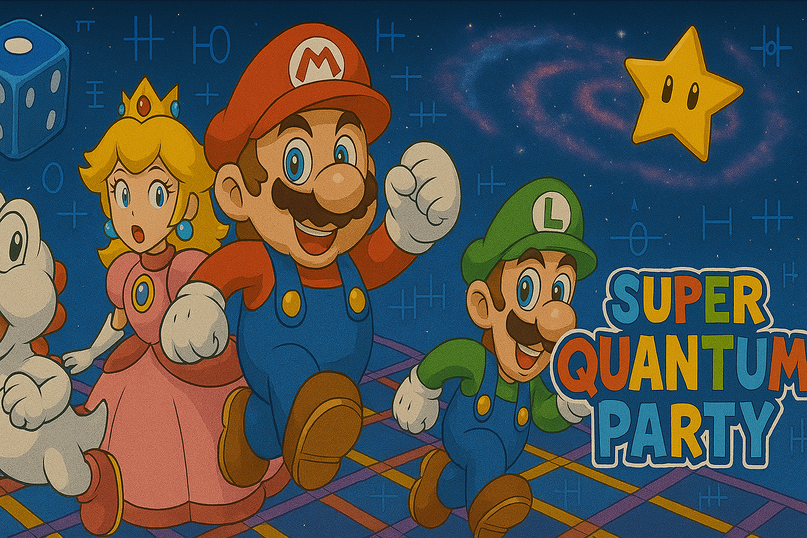
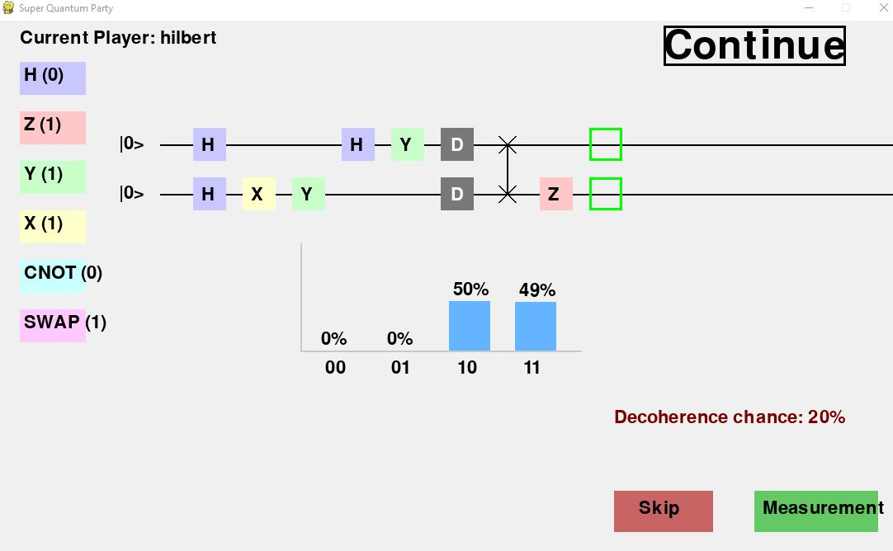

# Super Quantum Party



## 1. Overview

Super Quantum Party is the winning submission from the **Quantum ETS1** team (Felix Wilhelmy, Charles A. Bédard, Gabriel Lemay, Guy-Philippe Nadon) at **iQuCodeFest 2025**. The 30‑hour on‑site hackathon took place 19–20&nbsp;June&nbsp;2025 at Polytechnique Montréal and was organized by Polytechnique Montréal, Institut quantique / Université de Sherbrooke, University of Calgary, École de technologie supérieure (ÉTS), Quantum City and PINQ².

The main challenge was to redesign a classic board game by integrating quantum concepts and deliver a Python prototype with playable rules. This repository contains our prototype built with Python 3.11, Qiskit/IBM Quantum (via PINQ² credentials) and the standard SciPy stack.

## 2. Game concept & quantum mechanics

The prototype reimagines a **Mario-Party–style board game** where every classic action is “quantum-fied.” Players race around a tile-based map, collect Stars, and leverage quantum gates to reshape the board's configuration.

### 3.2 Game Loop  
1. **Player Setup**  
   * Each participant enters a name and you choose the order of playing.  
2. **Quantum Roll (Movement Phase)**  
   * Press **Space** to roll the **quantum die** (implemented as a quantum random walk).  
   * Your token advances by the measured outcome.  
3. **Board Interactions**  
   * **Blue Tiles** Grant **1–4 quantum gates** (stored in inventory).  
   * **Star Tiles** Passing a Star automatically adds one Star to your inventory.  
   * **Intersections** Choose paths with the keyboard arrows, then confirm with **Space**.  
4. **Mini-Game (End-of-Turn Superposition Phase)**  
   * A sub-game appears, showing the quantum circuit composer.  
   * Players place gates they’ve collected onto this circuit to steer the measurement and hinder rivals’ path to Stars while enhancing your own. 
   * Loading too many gates into the circuit will cause decoherence!!  
   * **Important:** click **Measurement** *before* Continue to commit the collapse and change the map configuration.
5. **Victory Condition**  
   * After a predefined number of turns, the player with the **most Stars** *(primary)* and **most remaining gates** *(tiebreaker)* wins.

**Pro-Tip:** The more intelligently you schedule gate placements, the higher your odds of forcing a board state favorable to your strategy!



## 3. Installation & quick‑start

### Conda
```bash
conda create -n quantum-party python=3.11
conda activate quantum-party
pip install -r requirements.txt
```

### pip only
```bash
python -m venv .venv
source .venv/bin/activate  # Windows: .venv\Scripts\activate
pip install -r requirements.txt
```

## 4. Usage examples

### Build your own map
```python
from super_quantum_party.maps.yaml_map import build_graph_from_yaml
my_map = build_graph_from_yaml("super_quantum_party/maps/new_map.yml")
```

### Running the game
From the repository root:
```bash
$ python -m super_quantum_party
```

## 5. Contributing

We welcome pull requests for bug fixes, docs and new ideas! Fork the repo, create a feature branch and open a PR.

## 6. License & acknowledgments

This project is released under the [MIT License](LICENSE).

**Acknowledgments**  
- iQuCodeFest 2025 organizers and backers — Polytechnique Montréal, Institut quantique / Université de Sherbrooke, University of Calgary, École de technologie supérieure (ÉTS), Quantum City, and PINQ² — for hosting an outstanding event.  
- IBM Quantum / Qiskit community for providing cloud access to real quantum hardware.  
- We acknowledge the use of **OpenAI ChatGPT** for rapid brainstorming, code-snippet generation, and documentation assistance during the competition.

If you reuse or extend our code, please credit the sources above.

---

### About Quantum ÉTS

Quantum ÉTS is a growing community of students exploring quantum information science. [Learn more](https://quantumets.etsmtl.ca/).
